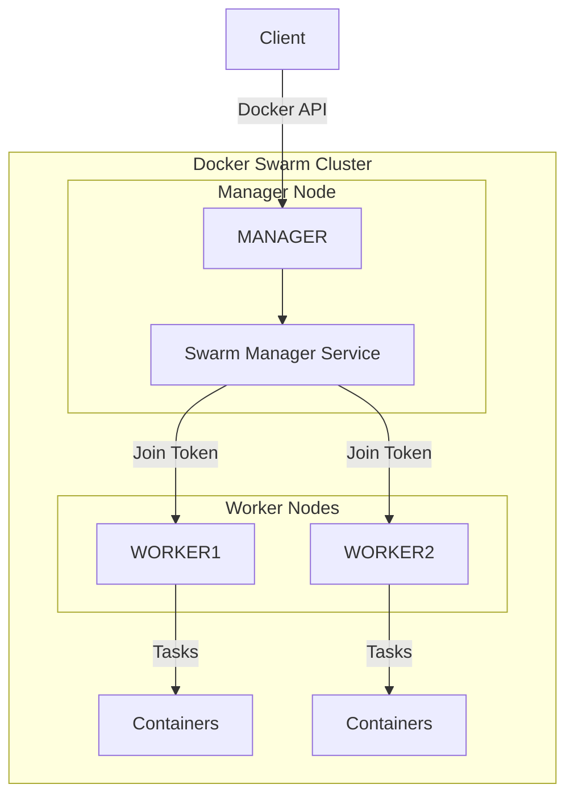

# Ansible Role: install-docker-swarm

This Ansible role installs and configures a Docker Swarm cluster with manager and worker nodes. Supports Debian/Ubuntu and RedHat/Rocky Linux systems.

## Docker Swarm Cluster Architecture



### Key Components

1. **Manager Node**: Responsible for orchestrating the swarm and maintaining the desired state
   - Runs the Raft consensus algorithm
   - Handles API requests
   - Schedules services to worker nodes
   - Maintains cluster state

2. **Worker Nodes**: Execute containers as scheduled by the manager
   - Run Docker containers
   - Report status back to manager

3. **Services**: Define the desired state of applications running on the swarm
   - Replicated or global deployment modes
   - Automatic load balancing
   - Rolling updates

4. **Tasks**: Scheduled instances of services that run on worker nodes
   - Container execution units
   - Automatically rescheduled on node failure

### Network Architecture

Docker Swarm creates three network types:
- **Overlay**: Multi-host network for service communication
- **Ingress**: Special overlay network for routing external traffic to services
- **Docker Bridge**: Local network on each node

### High Availability

- Multiple manager nodes can be configured (recommended 3, 5, or 7)
- Automatic failover if a manager node goes down
- Worker nodes continue running containers even if they lose connection to managers

## Requirements

- Ansible 2.9 or higher
- Root access on target systems
- Properly configured inventory with manager and worker nodes
- Supported operating systems:
  - Debian/Ubuntu
  - RedHat/Rocky Linux

## Role Variables

No variables are required as the role uses host groups to determine the installation type (manager vs worker). However, the following variables can be customized if needed:

```yaml
# Docker Swarm configuration
swarm_manager_port: 2377
swarm_enable_autolock: false
swarm_availability: "active"  # Options: active, pause, drain

# Docker daemon configuration
docker_daemon_options: {}
```

## Dependencies

None, but the following roles are recommended to be run first:
- update-packages
- install-docker

## Inventory Setup

Your inventory file should define the manager and worker nodes. Example:

```ini
[docker_swarm_cluster]
MANAGER ansible_host=192.168.1.10
WORKER1 ansible_host=192.168.1.11
WORKER2 ansible_host=192.168.1.12

[docker_swarm_manager]
MANAGER

[docker_swarm_workers]
WORKER1
WORKER2
```

Important notes about the inventory:
- The manager node MUST be named 'MANAGER' in the inventory (case-sensitive)
- Worker nodes can have any name, but should not be named 'MANAGER'
- The manager node must be accessible by all worker nodes on port 2377
- Worker nodes will automatically join the cluster using the manager's token

## Example Playbook

```yaml
- hosts: all
  become: true
  roles:
    - update-packages
    - install-docker

- hosts: all
  become: true
  roles:
    - install-docker-swarm
```

## Installation Process

The role performs the following:
1. Installs required dependencies (curl, apt-transport-https, ca-certificates)
2. Initializes Docker Swarm on the manager node with:
   - Proper advertise address using the inventory's ansible_host
3. Retrieves the Docker Swarm join token for workers
4. Joins worker nodes to the swarm with:
   - Proper node naming using inventory_hostname
   - Connection to manager using manager's ansible_host IP

### Network Configuration

The role automatically configures:
- Manager node to advertise on its ansible_host IP
- Worker nodes to connect to manager using its ansible_host IP
- Each node is configured with its proper hostname from inventory

This ensures proper cluster networking and node communication.

## Post-Installation

After installation:
1. Docker Swarm will be initialized on the manager node
2. Worker nodes will be joined to the swarm automatically
3. You can verify the swarm status by running `docker node ls` on the manager node
4. Reference Links:
   1. Docker Swarm - [https://docs.docker.com/engine/swarm/](https://docs.docker.com/engine/swarm/)
   2. Docker Compose - [https://docs.docker.com/compose/](https://docs.docker.com/compose/)
   3. Docker Documentation - [https://docs.docker.com/](https://docs.docker.com/)

## License

MIT

## Author Information

Created by WFHT
